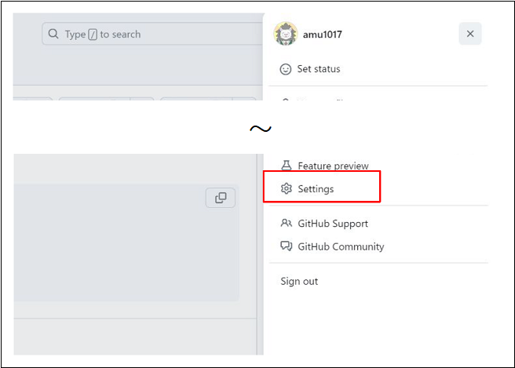
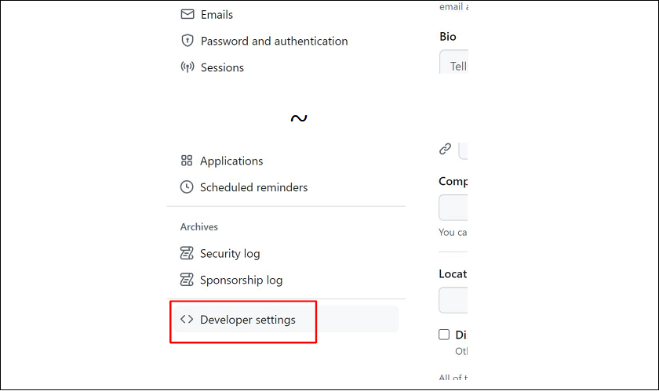
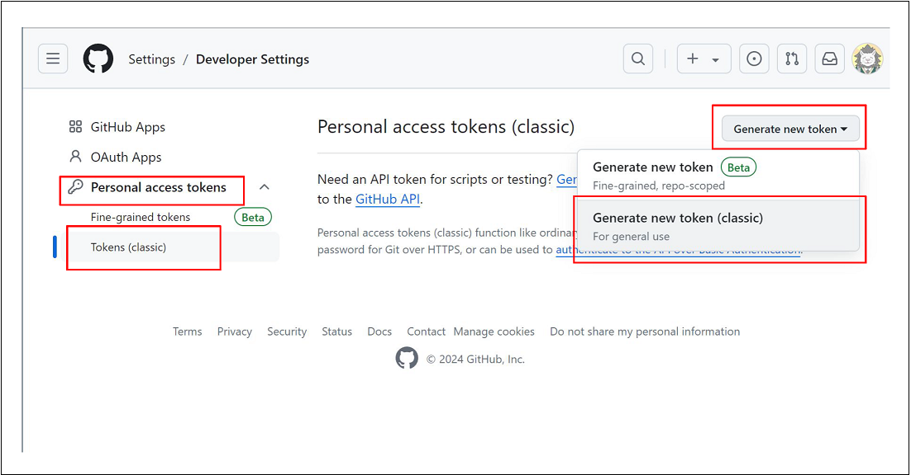
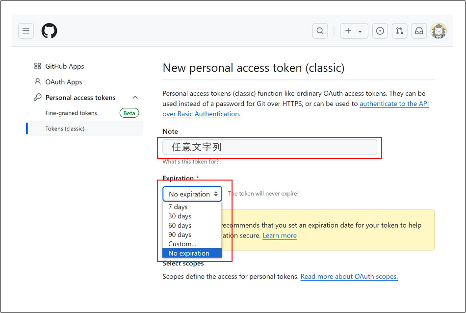
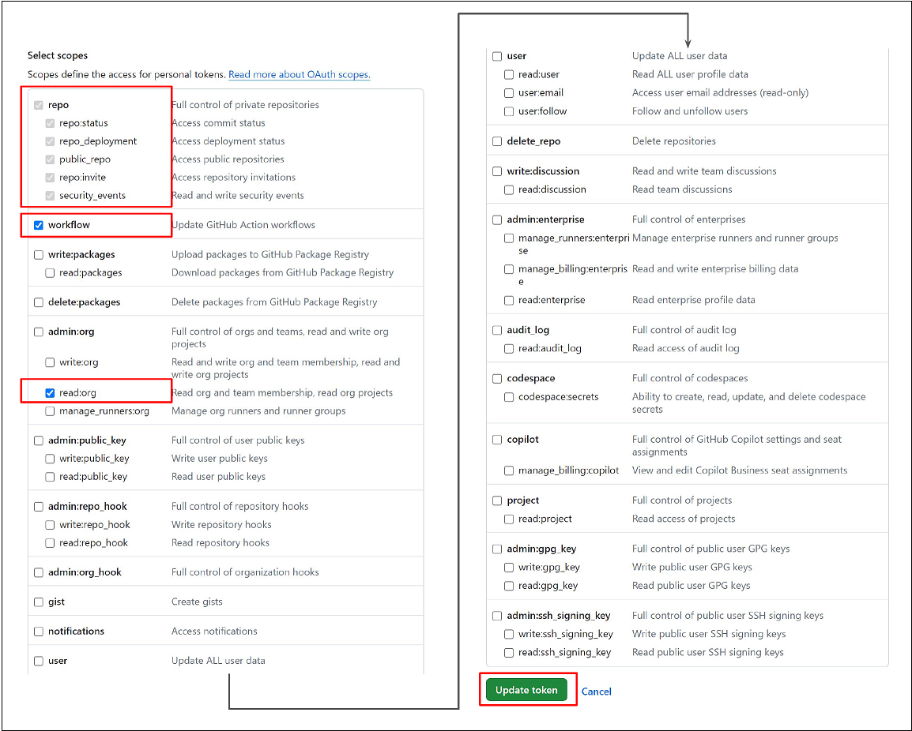
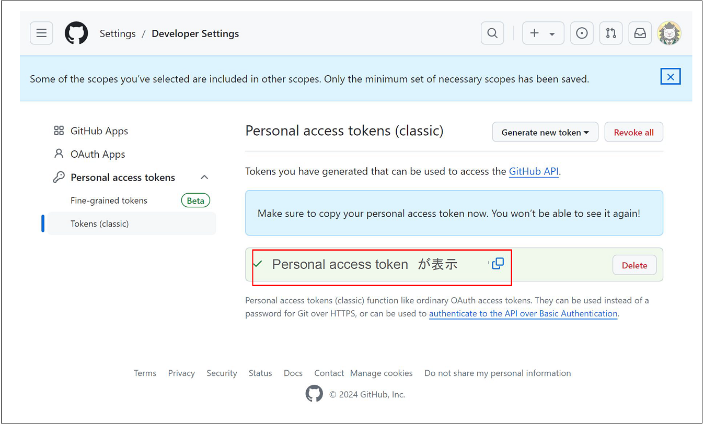

# 01-初期設定

- [インストール](#インストール)
- [github アカウントの作成](#github-アカウントの作成)
- [github の Personal access token 発行](#github-の-personal-access-token-発行)
- [git 初期設定](#git-初期設定)

## インストール

1. Linux 環境を用意します。

2. Hugo をローカルにインストールします。

3. git をローカルにインストールします。

4. github CLI をローカルにインストールします。

> [!TIP]
> Docker コンテナ[レシピ](./appendix-docker-hugo.md)を使うと 2.~4.インストール済みをスキップ出来ます。

## github アカウントの作成

今後記述します。

> [!IMPORTANT]
> 2FA は必ず有効にしてください。

## github の Personal access token 発行

1. github のメニューから「Settings」を開きます。
   

2. 「Developer settings」を開きます。
   

3. 「Personal access tokens」を展開して画像の通りに開きます。
   

4. 「Note」は任意文字列、「Expiration」は任意の有効期限を選択します。（No expiration がおすすめ）
   

5. 画像の通りに権限を付与して「Update token」を押します。
   

6. Personal access token が表示されます。
   

> [!CAUTION]
> 一度閉じたら二度と表示できません。

## git 初期設定

1.  おまじないを入力します。

```bash
git config --global init.defaultBranch default
git config --global user.name "名無し"
git config --global user.email nanasi@localhost.local
```

2.  github CLI でログインします。

```bash
gh auth login

? What account do you want to log into?
> GitHub.com

? What is your preferred protocol for Git operations? HTTPS
> HTTPS

? Authenticate Git with your GitHub credentials?
> Yes
> (出ない場合もある)

? How would you like to authenticate GitHub CLI?
>Paste an authentication token
>(Personal access tokenを貼り付ける)
```

3. github のログイン状況を確認します。

```bash
gh auth status
```

4.  github CLI のログイン情報を git で参照するようにします。

```bash
gh auth setup-git
```
