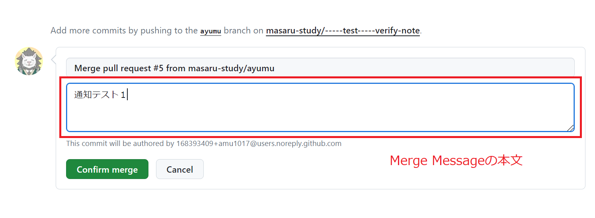

# ハンズオンチームの秘密基地

## ここはなに？

まさるの勉強部屋参加者のハンズオンチームの検証結果置き場です。

## つかいかた

- 権限のあるメンバーは hugo を使用して記事を投稿できます。

1. Hugo をローカルに入れます。
2. git をローカルに入れます。

3. ローカルリポジトリを作成する

```bash
git init
```

4. リモートリポジトリに接続する

```bash
git remote add origin https://github.com/masaru-study/verify-note.git
```

5. リモートリポジトリの内容を取得する

```bash
git fetch
```

6. ローカルブランチを作成する

```bash
git checkout -b #ローカルブランチ名# origin/main
```

7. hugo でコンテンツを作成する

```bash
hugo new content #カテゴリ名#/#ページ名#.md
もしくは
content/#カテゴリ名#/#ページ名#.mdを手動で新規作成
```

8. 記事の Front Matter を編集する

> [!CAUTION]
> 投稿フォルダによって必須タグ要件が異なりますので付録を参照してください。

```bash
content/#カテゴリ名#/#ページ名#.md
```

9. 記事の本文を編集する

```bash
content/#カテゴリ名#/#ページ名#.md
```

10. ワークツリーからインデックスへのファイルの登録を行う

```bash
git add -A
```

11. ローカルリポジトリに登録する

```bash
git commit -m "#コミットコメントを入れる#"
```

12. リモートリポジトリにコピーする

```bash
git push origin #ローカルブランチ名#
```

13. [Github リポジトリ](https://github.com/masaru-study/verify-note)に Web アクセスして結合する。

    1. Pull Request
    2. New Pull Request
    3. base:main ← compare:#ローカルブランチ名#
    4. Create request
    5. Create pull request
    6. Merge pull request
    7. Confirm Merge

14. [公開 Web ページ](https://masaru-study.github.io/verify-note/)を確認して更新されていれば完了

> [!TIP]
> ２回目以降の記事投稿は手順 5 ～ 14 を行ってください。

## 付録:Discord 通知

### 通知の著者名

Github 上の名前が反映されます。デフォルトはアカウント ID です。  
日本語名にしたい場合は、アカウント設定の Public profile の Name を変更してください。

### 通知の投稿内容文

Merge Message の本文が表示されます。複数行も表示可能です。(上記手順の 13-6 ～ 13-7)  
なお、タイトル文は表示されません。


### 通知の無効化

以下のどちらかの条件を満たすと Discord 通知を行わなくなります。

- プロジェクトのルートディレクトリに no_discord.txt を配置する
- Merge Message の本文に「no_discord」という文字列を含む(上記手順の 13-6 ～ 13-7)

## 付録:ディレクトリ構造

```
│
├── content
│   ├── _index.md         ・・・トップページの記事ファイル。
│   │
│   ├── cloud             ・・・Cloudカテゴリの記事を入れるフォルダ。_index.mdはカテゴリトップページ。
│   │   ├── _index.md           必須タグ：Author、Level
│   │   └── ＊＊＊.md
│   ├── general           ・・・Generalカテゴリの記事を入れるフォルダ。_index.mdはカテゴリトップページ。
│   │   ├── _index.md           必須タグ：Author
│   │   └── ＊＊＊.md
│   ├── network           ・・・Networkカテゴリの記事を入れるフォルダ。_index.mdはカテゴリトップページ。
│   │   ├── _index.md           必須タグ：Author、Level
│   │   └── ＊＊＊.md
│   ├── other             ・・・Otherカテゴリの記事を入れるフォルダ。_index.mdはカテゴリトップページ。
│   │   ├── _index.md           必須タグ：Author
│   │   └── ＊＊＊.md
│   └── server            ・・・Serverカテゴリの記事を入れるフォルダ。_index.mdはカテゴリトップページ。
│       ├── _index.md           必須タグ：Author、Level
│       └── ＊＊＊.md
│
├── static
│   ├── img               ・・・画像を入れるフォルダ。記事内で/img/＊＊＊とすると参照する。
│   │   ├── ＊＊＊.py
│   │   └── ＊＊＊.zip
│   └── other             ・・・画像以外を入れるフォルダ。記事内で/file/＊＊＊とすると参照する。
│       ├── ＊＊＊.svg
│       └── ＊＊＊.jpg
│
├── README.md             ・・・Githubリポジトリに表示される説明文。公開Webページには表示されない。
│
├── hugo.toml             ・・・公開Webページの設定ファイル。原則編集しない。
│
├── archetypes
│   └── default.md        ・・・記事ファイルのテンプレートファイル。原則編集しない。
│
└── themes                ・・・テーマが入っているフォルダ。原則編集しない。
    └── ＊＊＊
```
