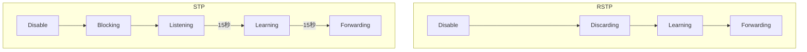

+++
title = 'STP and RSTP'
date = 2024-05-05T05:36:53+09:00
weight = 1
draft = false
categories = ["Network"]
tags = ["Author:DD Erikson", "Level:中級", "Type:Knowledge", "CCNA", "Spanning Tree Protocol"]
+++

# STP と RSTP

## STP と RSTP の違い

- STP では BPDU の保持時間（最大エージ 20 秒）の経過後、状態遷移があり、Listening と Learning で 15 秒の転送遅延が有るので最小で 50 秒間の状態遷移時間を経てフォワーディング状態になる
- RSTP では事前に代替ポートとバックアップポートが選出されているため、ルートポートがダウンしても数秒で収束する。もしもルートポートで障害が起きた場合即座に代替ポートがフォワーディング状態になる。

## 状態遷移

## ポートの状態について

- STP
  - Disabled・・・管理コマンドで無効化されている状態
  - Blocking・・・デバイスが初めて接続した時 Blocking になる
  - Listhning・・・BPDU を受信し、また受信を待機している状態
  - Learning・・・自分よりも優先度が高い BPDU を受信した場合、自分の BPDU の送信を止め、優先度が高い BPDU を転送する。
  - Forwarding・・・トラフィックを転送している状態
- RSTP
  - Disabled・・・管理コマンドで無効化されている状態
  - Discarding・・・デバイスが接続された時に Discarding になる
  - Learning・・・優先度が高い BPDU を受信したため、BPDU の送信を止め、優先度が高い BPDU を転送している状態
  - Forwarding ・・・トラフィックを転送できる状態

## ポートの役割

- STP
  - ルートポート（Root）・・・ルートブリッジ以外のスイッチで、ルートスイッチまでの経路コストが最も低いポートが Root になる。ルートブリッジにデータを転送する。
  - 指定ポート（Designated）・・・ルートブリッジに最も近いポートが Designated になる。ルートブリッジ側のポートは全て Designated になる。
  - 非指定ポート（Blocked）・・・Root にも Desginated にも選ばれなかったポート
- RSTP
  - ルートポート（Root）・・・ルートブリッジ以外のスイッチ上のポートで、ルートブリッジまでの経路コストが最も低いポート。ルートブリッジへデータを転送します。
  - 指定ポート（Designated）・・・ルートブリッジに最も近いポートが Designated になる。ルートブリッジ側のポートは全て Designated になる。
  - 代替ポート（Alternate）・・・他のスイッチからの BPDU を受け入れるが、Discarding になるポート。ルートポートのバックアップ用のポート。STP で言うところの非指定ポートがあたる。
  - バックアップポート（Backup） - 自身のスイッチから BPDU を受信するが、ブロックになるポート。ハブを使った場合に発生する。代替ポートのバックアップになる。複数の非指定ポートの中で送信元ポート ID が小さいポートが DP になる。
