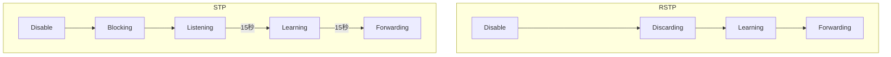

+++
title = 'STP and RSTP'
date = 2024-05-05T05:36:53+09:00
weight = 1
draft = false
categories = ["Network"]
tags = ["Autor:DD Erikson", "CCNA", "Spanning Tree Protocol"]
+++
# STPとRSTP

## STPとRSTPの違い

* STPではBPDUの保持時間（最大エージ20秒）の経過後、状態遷移があり、ListeningとLearningで15秒の転送遅延が有るので最小で50秒間の状態遷移時間を経てフォワーディング状態になる
* RSTPでは事前に代替ポートとバックアップポートが選出されているため、ルートポートがダウンしても数秒で収束する。もしもルートポートで障害が起きた場合即座に代替ポートがフォワーディング状態になる。

## 状態遷移

## ポートの状態について

* STP
  * Disabled・・・管理コマンドで無効化されている状態
  * Blocking・・・デバイスが初めて接続した時Blockingになる
  * Listhning・・・BPDUを受信し、また受信を待機している状態
  * Learning・・・自分よりも優先度が高いBPDUを受信した場合、自分のBPDUの送信を止め、優先度が高いBPDUを転送する。
  * Forwarding・・・トラフィックを転送している状態
* RSTP
  * Disabled・・・管理コマンドで無効化されている状態
  * Discarding・・・デバイスが接続された時にDiscardingになる
  * Learning・・・優先度が高いBPDUを受信したため、BPDUの送信を止め、優先度が高いBPDUを転送している状態
  * Forwarding ・・・トラフィックを転送できる状態

## ポートの役割

* STP
  * ルートポート（Root）・・・ルートブリッジ以外のスイッチで、ルートスイッチまでの経路コストが最も低いポートがRootになる。ルートブリッジにデータを転送する。
  * 指定ポート（Designated）・・・ルートブリッジに最も近いポートがDesignatedになる。ルートブリッジ側のポートは全てDesignatedになる。
  * 非指定ポート（Blocked）・・・Root にも Desginated にも選ばれなかったポート
* RSTP
  * ルートポート（Root）・・・ルートブリッジ以外のスイッチ上のポートで、ルートブリッジまでの経路コストが最も低いポート。ルートブリッジへデータを転送します。
  * 指定ポート（Designated）・・・ルートブリッジに最も近いポートがDesignatedになる。ルートブリッジ側のポートは全てDesignatedになる。
  * 代替ポート（Alternate）・・・他のスイッチからの BPDU を受け入れるが、Discardingになるポート。ルートポートのバックアップ用のポート。STPで言うところの非指定ポートがあたる。
  * バックアップポート（Backup） - 自身のスイッチからBPDUを受信するが、ブロックになるポート。ハブを使った場合に発生する。代替ポートのバックアップになる。複数の非指定ポートの中で送信元ポートIDが小さいポートがDPになる。
