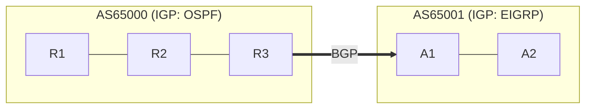
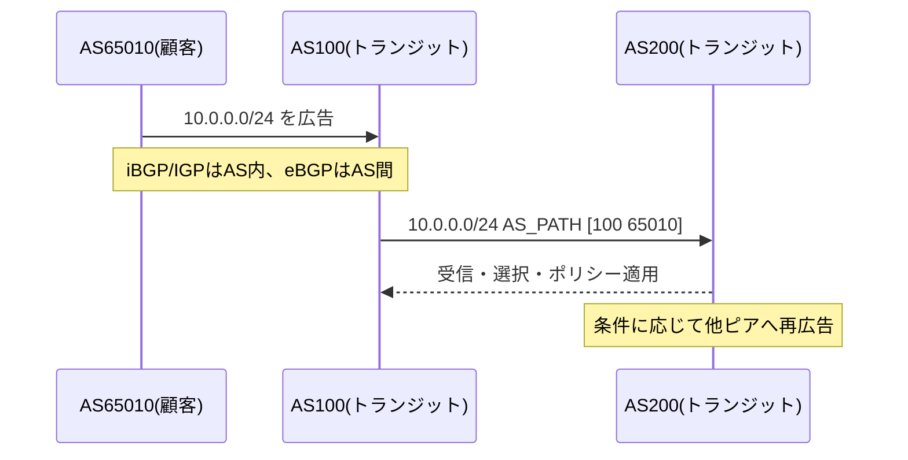
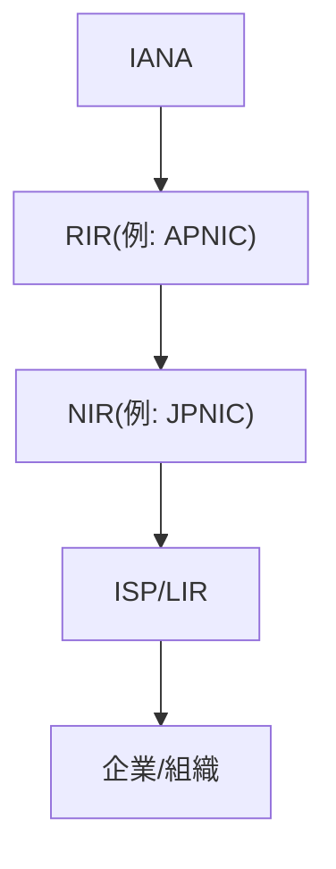
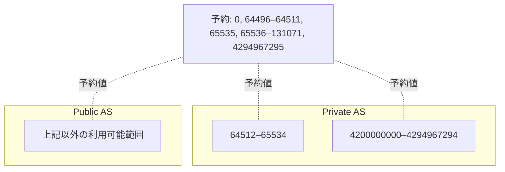
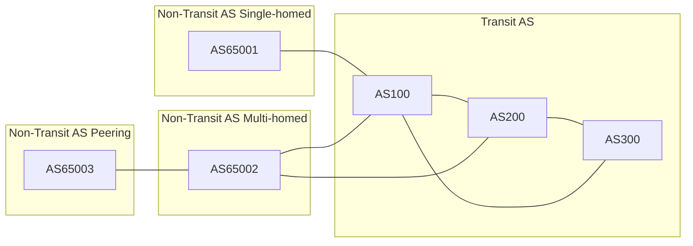

+++
#テンプレート：デフォルト
title = 'Cisco_BGPの基本_AS編'
date = 2025-09-06T15:04:00+09:00
draft = false
#weight = 99 # 順番を意図的に変更したい場合は変更する
categories = ["Network"]
tags = ["Author:nakata216", "Level:初級", "Type:Knowledge", "CCNP"]
+++

- [概要](#概要)
- [IGPとEGPについて](#igpとegpについて)
- [ASとは](#asとは)
- [グローバルASとプライベートAS](#グローバルasとプライベートas)

## input

- [JPNIC:インターネット10分講座：BGP](https://www.nic.ad.jp/ja/newsletter/No35/0800.html)
- [JPNIC:AS番号の割り当てに関する参考情報](https://www.nic.ad.jp/doc/jpnic-01244.html)

## 概要

本記事ではBGPを学習する上での前提となるASの概念について記載します。

## IGPとEGPについて

ASを学習する上でIGPとEGPの知識は必須となります。 
*   IGP 
    自律システム(AS:Autonomous System)内で経路交換を行うルーティングプロトコルとなり、OSPFやEIGRP、RIP等のプロトコルが対象となります。 
*   EGP 
    AS間の経路交換を行うルーティングプロトコルとなり、BGPやEGPが対象となります。 

## ASとは

ASとは、組織毎の運用ポリシーを持った一つのネットワークのかたまりを示します。このASの管理を行っているは一般的にISPになりますが、学術系ネットワークやデータセンターなどである場合もあります。このASを識別するのに使用されるのがAS番号です。 
ASは誰でも自由に作成できるわけではありません。 
ASはIANAという組織が世界的に管理しており、IANAから各地域の地域インターネットレジストリ(RIR:Regional Internet Registry)にASが分配されます。 
ASを作成するにはRIRまたは国別インターネットレジストリ(NIR:National Internet Registry)に申請する必要があります 
※日本ではJPNICが申請を受け付けてます。 
※後述するプライベートASは自由に使用することが出来ます。

## グローバルASとプライベートAS
AS番号は2バイトまたは4バイトで表現され、0～4294967295までの番号空間を持ちます。 
この番号空間の中ではグローバルASとプライベートASに分かれており、番号空間は下記の表になります。 

|AS番号|用途|
|:---:|:---:|
|0～64511、65535～4199999999、4294967295|グローバルAS|
|64512～65534、4200000000～4294967294|プライベートAS|
※0、64496～64511、65535、 65536～131071と4294967295はICANNによって予約されています。

*   グローバルAS 
    インターネット上に経路広報を行う場合に使用するAS番号となり、使用する場合はRIRやNIRに申請する必要があります。 

*   プライベートAS 
    自AS内で自由に使用できるAS番号。ISPが提供する同時のIP-VPN網はこのプライベートASが利用されている。 
    プライベートASの経路情報は自AS以外に広報してはいけません。 

## ASの接続形態について

各ASの接続形態は複数あり、それぞれでASを通過できたり、出来なかったりします。 

*   スタブAS 
    シングルホームASとも呼ばれており、他に繋がっているASが一つのみの場合を指します。 

*   トランジットAS 
    複数のASが接続されており、自組織以外のアドレスを接続先にアナウンスするASを「トランジットAS」と言いいます。

*   非トランジットAS 
    複数のASが接続されており、自組織のアドレスだけを接続先にアナウンスするASを「非トランジットAS」と言います。非トランジットASは一般的に、フルルートを上流ISPから取得する必要があります。

## まとめ

BGPを学習する上でASの概念がないと、パスディストリビューリストを理解することが困難になります。また、白本での学習でもいいですが、BGPに関してはJPNICの記事で学習することをお勧めします。
